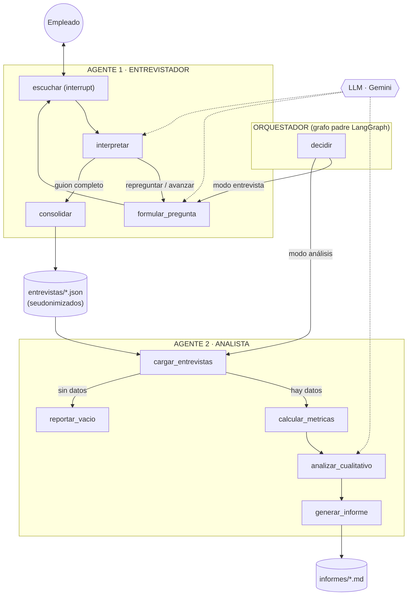

# Sistema Multiagente de Medición de Clima Laboral

> Reto técnico — Ingeniero de Inteligencia Artificial · SETI S.A.S.
> Autor: Andrés Felipe Giraldo Hincapié

## El problema

Las encuestas tradicionales de clima laboral tienen un defecto estructural: los
empleados no responden con sinceridad por miedo a represalias, incluso cuando la
encuesta es anónima. El formato rígido de formulario refuerza esa desconfianza y
produce datos pobres sobre los que se toman decisiones importantes.

**La solución:** reemplazar la encuesta por una **conversación anónima con un
agente de IA**, que cubre siempre el mismo guion de 16 preguntas (8 dimensiones)
pero en lenguaje natural, deja que la persona responda libremente e interpreta
cada respuesta. Un segundo agente consolida todas las entrevistas y genera el
informe general de clima con métricas y análisis cualitativo.

## Arquitectura

Dos agentes con roles diferenciados y un orquestador explícito, implementados
como grafos de **LangGraph**:

- **Agente Entrevistador ("Clima")** — conduce la entrevista conversacional con
  *human-in-the-loop* (`interrupt`), interpreta cada respuesta (puntaje 1–5,
  sentimiento, temas), repregunta ante respuestas evasivas y consolida un
  registro **seudonimizado** en `entrevistas/`.
- **Agente Analista** — se sincroniza con los registros, calcula métricas con
  **código determinista** (auditables y reproducibles), usa el LLM solo para el
  análisis cualitativo y genera el informe en `informes/`.
- **Orquestador** — grafo padre que valida la solicitud y enruta hacia el agente
  correspondiente. Los agentes se comunican de forma asíncrona a través de los
  artefactos JSON (almacén compartido).



Diagrama y flujo detallados: [`docs/arquitectura.md`](docs/arquitectura.md) ·
Decisiones y trade-offs: [`DECISIONES.md`](DECISIONES.md) ·
Ejemplo de informe generado: [`docs/informe_ejemplo.md`](docs/informe_ejemplo.md)

## Instalación (Windows 11)

Requisitos: [Python 3.12+](https://www.python.org/downloads/) (marcar
*"Add Python to PATH"* al instalar) y [Git](https://git-scm.com/).

```powershell
git clone https://github.com/<usuario>/clima-laboral-agentes.git
cd clima-laboral-agentes

python -m venv .venv
.venv\Scripts\activate
# Si PowerShell bloquea la activación, ejecutar una vez:
# Set-ExecutionPolicy -ExecutionPolicy RemoteSigned -Scope CurrentUser

pip install -r requirements.txt
copy .env.example .env
# Editar .env y colocar la GOOGLE_API_KEY (gratuita en https://aistudio.google.com)
```

En Linux/macOS la activación es `source .venv/bin/activate` y la copia
`cp .env.example .env`.

## Uso

### Interfaz web (recomendada para la demo)

```powershell
streamlit run app.py
```

Dos pestañas sobre los **mismos grafos** que usa el CLI:

- **Entrevista** — chat conversacional con el Agente Entrevistador
  (seudónimo visible, progreso de preguntas, salida anticipada con `salir`).
  Ámbito seleccionable: **compañía en general** o **un equipo específico**.
- **Configuración** — panel de administración: editar/agregar/eliminar
  preguntas del guion, ajustar el prompt del Entrevistador (personalidad,
  reglas, transiciones, repreguntas), los parámetros del Analista (umbral de
  alerta, límites del análisis, métrica de permanencia) y el modelo LLM.
  Cambios persistidos en `config/configuracion.json` y aplicados de inmediato.
- **Dashboard** — segmentable por ámbito (toda la compañía o un equipo), con
  desglose de índice por equipo y observabilidad diferenciada por agente.
  Incluye participación (entrevistas respondidas, completadas vs.
  parciales, entrevistas por día), resultados de clima (índice general,
  promedios por dimensión, temas, dimensiones en riesgo), generación del
  informe con el Agente Analista y **observabilidad de los agentes**:
  llamadas al LLM por agente/nodo, latencia media, errores y tasa de
  finalización de entrevistas (abandono).

### Línea de comandos

```powershell
# 1) Entrevista conversacional (Agente Entrevistador)
python main.py entrevistar

# 2) Consolidar todas las entrevistas y generar el informe (Agente Analista)
python main.py analizar

# Demo del Analista con 5 entrevistas sintéticas incluidas
python main.py analizar --dir datos_ejemplo

# Ámbito por equipo (entrevistar y analizar)
python main.py entrevistar --equipo "Tecnología"
python main.py analizar --equipo "Tecnología"
```

Durante la entrevista puedes escribir `salir` para terminar antes de tiempo:
el registro se consolida con las respuestas capturadas hasta ese momento.

### Modo offline (sin API key)

Todo el sistema puede probarse sin conexión ni credenciales usando un LLM
simulado — útil para validar la instalación y como plan de contingencia:

```powershell
# PowerShell
$env:USAR_LLM_FALSO="1"; python main.py analizar --dir datos_ejemplo
```

### Pruebas

```powershell
python -m tests.prueba_humo
```

Valida de extremo a extremo (en modo offline): las 16 preguntas con
*human-in-the-loop*, la repregunta ante respuestas evasivas, la consolidación
del registro, el cálculo de métricas, la generación del informe y el manejo de
un directorio sin entrevistas. La misma prueba corre automáticamente en
GitHub Actions en cada push (`.github/workflows/ci.yml`).

## Estructura del repositorio

```
├── app.py                      # Interfaz web: chat + dashboard (Streamlit)
├── main.py                     # CLI: entrevistar | analizar
├── src/
│   ├── orquestador.py          # Grafo padre (orquestación explícita)
│   ├── agentes/
│   │   ├── entrevistador.py    # Agente 1: entrevista conversacional
│   │   └── analista.py         # Agente 2: métricas + informe
│   ├── config/preguntas.py     # Guion: 16 preguntas / 8 dimensiones
│   └── utils/                  # llm.py (LLM real u offline) · telemetria.py
├── observabilidad/             # eventos.jsonl de telemetría (git-ignorado)
├── datos_ejemplo/              # 5 entrevistas sintéticas para la demo
├── entrevistas/  informes/     # Salidas de los agentes (git-ignoradas)
├── docs/                       # Arquitectura, informe de ejemplo, guion y slides
├── .github/workflows/ci.yml    # CI: prueba de humo en cada push
├── tests/prueba_humo.py        # Prueba end-to-end sin API
├── DECISIONES.md               # Documento de decisiones (1 página)
└── BITACORA_IA.md              # Uso de IA en el proceso de construcción
```

## Observabilidad

Cada llamada al LLM y cada hito de las entrevistas queda registrado en
`observabilidad/eventos.jsonl` (telemetría local, sin dependencias): agente,
nodo, latencia, éxito/error y eventos de participación. El dashboard los
presenta en vivo. Para trazas avanzadas de LangGraph, LangSmith se activa solo
con variables de entorno, sin cambios de código:

```
LANGSMITH_TRACING=true
LANGSMITH_API_KEY=...
```

## Privacidad por diseño

- La identidad del empleado **nunca se registra**: cada entrevista recibe un
  seudónimo aleatorio (`EMP-XXXX`) generado al inicio.
- El informe presenta únicamente **resultados agregados**; las notas por
  respuesta se redactan sin datos identificables.
- **Umbral de anonimato por equipo**: los equipos con menos entrevistas que el
  mínimo configurado no se reportan individualmente, para evitar
  reidentificación en grupos pequeños.
- Limitación conocida y trade-off asociado: ver `DECISIONES.md`.
