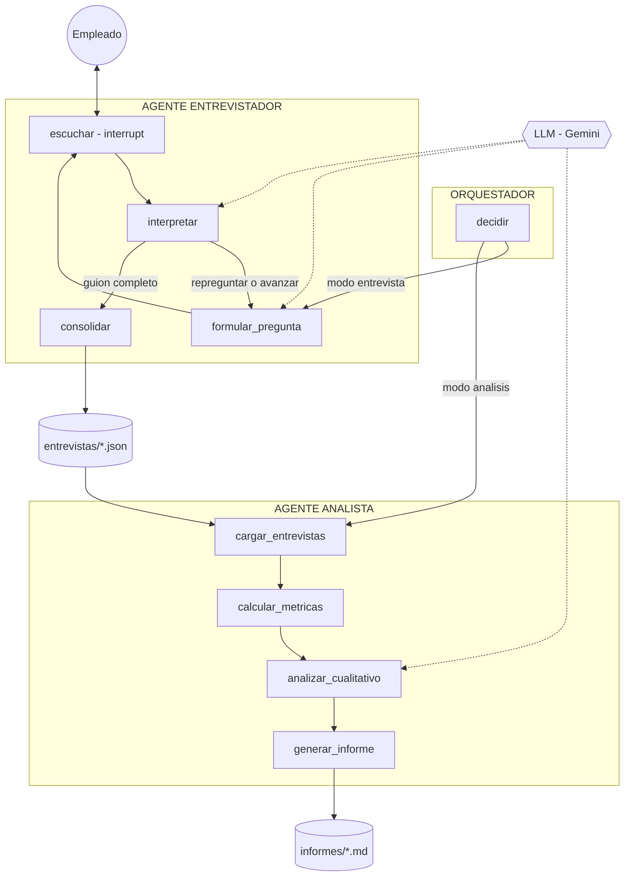

# Sistema Multiagente de Medicion de Clima Laboral

> Reto tecnico - Ingeniero de Inteligencia Artificial - SETI S.A.S.  
> Autor: Andres Felipe Giraldo Hincapie

Sistema multiagente construido con **LangGraph** para transformar la medicion de clima laboral en una conversacion anonima, trazable y analizable. El proyecto reemplaza el formulario tradicional por una entrevista conversacional con IA, interpreta las respuestas en tiempo real y consolida los resultados en informes agregados para apoyar decisiones de talento humano.

## Tabla de Contenido

- [Problema](#problema)
- [Propuesta de solucion](#propuesta-de-solucion)
- [Arquitectura](#arquitectura)
- [Funcionalidades principales](#funcionalidades-principales)
- [Stack tecnico](#stack-tecnico)
- [Instalacion](#instalacion)
- [Configuracion](#configuracion)
- [Uso](#uso)
- [Pruebas](#pruebas)
- [Estructura del repositorio](#estructura-del-repositorio)
- [Privacidad y seguridad](#privacidad-y-seguridad)
- [Observabilidad](#observabilidad)
- [Decisiones de diseno](#decisiones-de-diseno)
- [Limitaciones conocidas](#limitaciones-conocidas)

## Problema

Las encuestas tradicionales de clima laboral suelen producir informacion incompleta o sesgada. Aunque se comuniquen como anonimas, muchas personas responden con cautela por miedo a represalias, trazabilidad indirecta o uso indebido de la informacion.

Ademas, el formato rigido de formulario limita la expresion de matices importantes: malestar, confianza, reconocimiento, relacion con lideres, colaboracion, oportunidades de crecimiento o intencion de permanencia. Como consecuencia, las organizaciones pueden tomar decisiones relevantes con datos pobres, superficiales o poco accionables.

## Propuesta de Solucion

Este proyecto plantea una alternativa conversacional: un empleado interactua con un **Agente Entrevistador** que cubre siempre el mismo guion metodologico de 16 preguntas agrupadas en 8 dimensiones, pero lo hace en lenguaje natural. La persona puede responder libremente, pedir claridad o terminar antes de tiempo.

Cada respuesta se interpreta de forma estructurada con apoyo de IA: puntaje, sentimiento, temas mencionados y observaciones cualitativas. Luego, un **Agente Analista** consolida todas las entrevistas disponibles, calcula metricas auditables con codigo determinista y usa el LLM solo para enriquecer la lectura cualitativa del clima.

El resultado es un sistema que mantiene consistencia metodologica, mejora la experiencia del empleado y entrega evidencia agregada para la toma de decisiones.

## Arquitectura

La solucion esta organizada en dos agentes especializados y un orquestador explicito. Cada agente se implementa como grafo de **LangGraph**, con responsabilidades separadas y comunicacion asincrona mediante artefactos JSON.



### Componentes

| Componente | Responsabilidad | Salida principal |
| --- | --- | --- |
| Orquestador | Valida la solicitud y enruta hacia entrevista o analisis. | Ejecucion del grafo correspondiente. |
| Agente Entrevistador | Conduce la conversacion, interpreta respuestas y gestiona repreguntas. | Registro seudonimizado en `entrevistas/*.json`. |
| Agente Analista | Carga entrevistas, calcula metricas y genera analisis cualitativo. | Informe Markdown en `informes/*.md`. |
| Almacen compartido | Permite comunicacion asincrona entre agentes. | Artefactos JSON auditables. |
| Dashboard | Presenta participacion, metricas, riesgos y observabilidad. | Vista ejecutiva en Streamlit. |

## Funcionalidades Principales

- **Entrevista conversacional anonima** con seudonimo aleatorio `EMP-XXXX`.
- **Guion consistente** de 16 preguntas distribuidas en 8 dimensiones de clima.
- **Human-in-the-loop** mediante `interrupt()` de LangGraph.
- **Repreguntas controladas** ante respuestas evasivas, ambiguas o insuficientes.
- **Salida anticipada** con `salir`, conservando respuestas parciales.
- **Medicion por ambito**, ya sea compania completa o equipo especifico.
- **Dashboard en Streamlit** con participacion, promedios, dimensiones en riesgo, temas recurrentes y generacion de informe.
- **Panel de configuracion** para editar preguntas, prompts, equipos, parametros del analista, umbrales y modelo LLM.
- **Modo offline** con LLM simulado para pruebas, demo y contingencia.
- **Observabilidad local** por agente, nodo, latencia, exito, error y eventos de participacion.
- **Pruebas end-to-end** sin depender de credenciales externas.

## Stack Tecnico

| Capa | Tecnologia |
| --- | --- |
| Lenguaje | Python 3.12+ |
| Orquestacion multiagente | LangGraph |
| LLM | Gemini mediante `langchain-google-genai` |
| Interfaz web | Streamlit |
| Procesamiento de datos | pandas |
| Configuracion | python-dotenv + JSON local |
| Persistencia operativa | Archivos JSON y Markdown |
| Observabilidad | JSONL local + LangSmith opcional |
| Pruebas | Scripts end-to-end y GitHub Actions |

## Instalacion

### Requisitos

- Python 3.12 o superior.
- Git.
- Una API key de Google AI Studio para ejecutar el LLM real.

> En Windows, al instalar Python se recomienda marcar la opcion **Add Python to PATH**.

### Windows 11

```powershell
git clone <url-del-repositorio>
cd clima-laboral-agentes

python -m venv .venv
.venv\Scripts\activate

pip install -r requirements.txt
copy .env.example .env
```

Si PowerShell bloquea la activacion del entorno virtual, ejecutar una sola vez:

```powershell
Set-ExecutionPolicy -ExecutionPolicy RemoteSigned -Scope CurrentUser
```

### Linux o macOS

```bash
git clone <url-del-repositorio>
cd clima-laboral-agentes

python -m venv .venv
source .venv/bin/activate

pip install -r requirements.txt
cp .env.example .env
```

## Configuracion

Crear el archivo `.env` a partir de `.env.example` y definir la clave del proveedor LLM:

```env
GOOGLE_API_KEY=tu_api_key
```

Para ejecutar el sistema sin credenciales, activar el modo offline:

```powershell
$env:USAR_LLM_FALSO="1"
```

En Linux o macOS:

```bash
export USAR_LLM_FALSO=1
```

La configuracion funcional del sistema se persiste en:

```text
config/configuracion.json
```

Desde la interfaz web se pueden modificar preguntas, prompts, equipos, umbrales, parametros del analista y modelo LLM. Los cambios se aplican inmediatamente sin reiniciar la aplicacion.

## Uso

### Interfaz web

```powershell
streamlit run app.py
```

La interfaz incluye tres vistas principales:

| Vista | Proposito |
| --- | --- |
| Entrevista | Chat conversacional con el Agente Entrevistador, progreso del guion y salida anticipada. |
| Configuracion | Administracion de preguntas, prompts, equipos, umbrales, analista y modelo LLM. |
| Dashboard | Indicadores de participacion, resultados de clima, riesgos, temas, equipos e informes. |

### Linea de comandos

Iniciar una entrevista:

```powershell
python main.py entrevistar
```

Generar el informe consolidado:

```powershell
python main.py analizar
```

Ejecutar el analisis con datos sinteticos de ejemplo:

```powershell
python main.py analizar --dir datos_ejemplo
```

Medir un equipo especifico:

```powershell
python main.py entrevistar --equipo "Tecnologia"
python main.py analizar --equipo "Tecnologia"
```

## Pruebas

Ejecutar la prueba de humo:

```powershell
python -m tests.prueba_humo
```

La prueba valida el flujo principal en modo offline:

- Entrevista completa con 16 preguntas.
- Uso de `interrupt()` para capturar respuestas.
- Repregunta ante respuestas evasivas.
- Consolidacion de entrevista seudonimizada.
- Calculo deterministico de metricas.
- Generacion de informe.
- Manejo de directorios sin entrevistas.

Cuando esta disponible, la suite tambien incluye pruebas de interfaz con Streamlit AppTest:

```powershell
python -m tests.prueba_interfaz
```

El flujo de CI ejecuta las pruebas automaticamente en GitHub Actions:

```text
.github/workflows/ci.yml
```

## Estructura del Repositorio

```text
.
|-- app.py
|-- main.py
|-- requirements.txt
|-- .env.example
|-- src/
|   |-- orquestador.py
|   |-- agentes/
|   |   |-- entrevistador.py
|   |   `-- analista.py
|   |-- config/
|   |   |-- configuracion.py
|   |   `-- preguntas.py
|   `-- utils/
|       |-- llm.py
|       `-- telemetria.py
|-- config/
|   `-- configuracion.json
|-- datos_ejemplo/
|-- entrevistas/
|-- informes/
|-- observabilidad/
|-- docs/
|   |-- arquitectura.md
|   |-- informe_ejemplo.md
|   |-- guion_sustentacion.md
|   `-- sustentacion.pptx
|-- tests/
|   |-- prueba_humo.py
|   `-- prueba_interfaz.py
|-- .github/workflows/ci.yml
|-- DECISIONES.md
|-- BITACORA_IA.md
`-- README.md
```

## Privacidad y Seguridad

El diseno sigue un enfoque de privacidad por defecto:

- No se solicita ni registra la identidad real del empleado.
- Cada entrevista se guarda con un seudonimo aleatorio.
- Los informes se generan sobre resultados agregados.
- Las notas cualitativas se redactan sin datos identificables.
- Los equipos con baja participacion no se reportan individualmente.
- Los archivos `.env`, `entrevistas/`, `informes/` y `observabilidad/` deben mantenerse fuera del control de versiones cuando contengan informacion sensible.

## Observabilidad

El sistema registra eventos locales en:

```text
observabilidad/eventos.jsonl
```

Cada evento permite revisar:

- Agente ejecutado.
- Nodo del grafo.
- Latencia.
- Resultado exitoso o error.
- Hitos de participacion.
- Tasa de finalizacion y abandono.

Para trazabilidad avanzada con LangSmith, definir:

```env
LANGSMITH_TRACING=true
LANGSMITH_API_KEY=tu_api_key
```

## Decisiones de Diseno

- **Separacion de responsabilidades**: el Entrevistador no genera informes y el Analista no conduce entrevistas.
- **Metricas deterministicas**: los calculos cuantitativos se hacen con codigo para que sean reproducibles y auditables.
- **LLM acotado**: el modelo se usa para lenguaje natural, interpretacion y sintesis cualitativa, no para calculos criticos.
- **Artefactos simples**: JSON para entrevistas y Markdown para informes, facilitando inspeccion, pruebas y versionamiento.
- **Modo offline**: permite validar la arquitectura y hacer demostraciones sin depender de credenciales, red o cuota del proveedor.
- **Umbral de anonimato**: protege equipos pequenos frente a reidentificacion indirecta.

## Limitaciones Conocidas

- El analisis depende de la calidad y profundidad de las respuestas entregadas por los empleados.
- El anonimato por equipo requiere un volumen minimo de entrevistas para que el reporte sea confiable.
- El LLM puede introducir variabilidad cualitativa, por eso las metricas principales se calculan fuera del modelo.
- La persistencia basada en archivos es suficiente para el reto tecnico, pero en produccion deberia evolucionar hacia una base de datos, control de acceso, cifrado y politicas formales de retencion.

## Documentacion Complementaria

- [`docs/arquitectura.md`](docs/arquitectura.md): arquitectura y flujo detallado.
- [`DECISIONES.md`](DECISIONES.md): decisiones y trade-offs principales.
- [`docs/informe_ejemplo.md`](docs/informe_ejemplo.md): ejemplo de informe generado.
- [`BITACORA_IA.md`](BITACORA_IA.md): uso de IA durante la construccion del proyecto.
