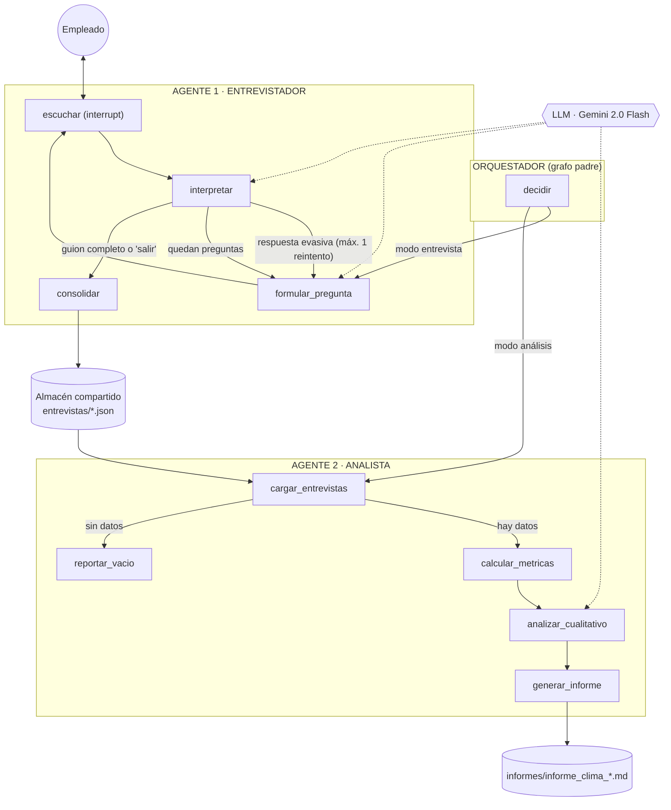

# Arquitectura del sistema

## Visión general

El sistema está compuesto por **dos agentes con roles diferenciados** y un
**orquestador explícito**, todos implementados como grafos de LangGraph.

| Componente | Rol | Herramientas |
|---|---|---|
| Orquestador (grafo padre) | Validar la solicitud y enrutar al agente correcto | LangGraph (aristas condicionales), checkpointer |
| Agente 1 · Entrevistador | Conducir la entrevista conversacional, interpretar respuestas, consolidar registro seudonimizado | LLM (Gemini), `interrupt()` human-in-the-loop, escritura JSON |
| Agente 2 · Analista | Cargar todas las entrevistas, calcular métricas deterministas, análisis cualitativo, informe | Lectura JSON, estadística en Python, LLM (Gemini), escritura Markdown |

## Diagrama de agentes y flujo de mensajes

## Mecanismo de orquestación

1. **Enrutamiento explícito.** El orquestador es un `StateGraph` padre: el nodo
   `decidir` valida la entrada (modo, seudónimo o directorio) y una arista
   condicional delega en el subgrafo del agente correspondiente. Los subgrafos
   se compilan con `checkpointer=True` para heredar la persistencia del padre.
2. **Human-in-the-loop.** El nodo `escuchar` del Entrevistador ejecuta
   `interrupt(...)`: el grafo completo se pausa, el CLI muestra la pregunta,
   captura la respuesta y reanuda con `Command(resume=respuesta)`. El estado
   (pregunta actual, historial, respuestas interpretadas) persiste en el
   checkpointer entre turnos.
3. **Sincronización entre agentes por artefactos.** El Entrevistador publica
   registros JSON seudonimizados en `entrevistas/`; el Analista los consume
   cuando se le invoca. Este bus de artefactos desacopla a los agentes en el
   tiempo: pueden ejecutarse N entrevistas (incluso en días distintos) y un
   único análisis posterior.

## Estado de cada grafo

- `EstadoOrquestador`: `modo`, `empleado_id`, `directorio`, `resultado`.
- `EstadoEntrevista`: `empleado_id`, `indice` (pregunta actual), `reintentos`,
  `historial` (conversación completa), `respuestas` (interpretadas),
  `siguiente_paso` (decisión de enrutamiento), `salida_anticipada`.
- `EstadoAnalisis`: `directorio`, `entrevistas`, `metricas`,
  `analisis_cualitativo`, `ruta_informe`.

## Capa de presentación y observabilidad

- **Dos front-ends, un solo núcleo:** `app.py` (Streamlit: chat + dashboard) y
  `main.py` (CLI) consumen los mismos grafos compilados; el patrón
  `interrupt`/`Command(resume=...)` es idéntico en ambos canales.
- **Telemetría:** `src/utils/telemetria.py` registra en
  `observabilidad/eventos.jsonl` cada llamada al LLM (agente, nodo, latencia,
  éxito) y los hitos `entrevista_iniciada`, `entrevista_finalizada` y
  `analisis_ejecutado`. El dashboard deriva de ahí las métricas operativas:
  volumen de llamadas por nodo, latencia media, errores y tasa de finalización
  (participación y abandono).

## Manejo de errores

| Fallo | Comportamiento |
|---|---|
| El LLM no devuelve JSON válido al interpretar | Se registra puntaje neutral (3) con nota explicativa y la entrevista continúa |
| Respuesta evasiva o vacía del empleado | Repregunta amable, máximo 1 vez por pregunta |
| El empleado abandona (`salir`, Ctrl+C) | Se consolida un registro parcial marcado `completada: false` |
| Archivo de entrevista corrupto | El Analista lo omite con aviso y sigue con el resto |
| Directorio sin entrevistas | Rama explícita `reportar_vacio` con mensaje claro |
| Fallo del LLM en el análisis cualitativo | El informe se genera igual con las métricas deterministas |
| Sin API key / sin internet | Modo `USAR_LLM_FALSO=1` para operar con LLM simulado |

## Escalabilidad

- Entrevistas **paralelizables por diseño**: cada una es un hilo (`thread_id`)
  independiente con su propio checkpoint; N empleados pueden conversar a la vez.
- El Analista es **O(n)** sobre los registros y separa cómputo determinista
  (barato, local) del cualitativo (una sola llamada LLM con contexto acotado).
- Rutas de evolución declaradas: base de datos con cifrado en lugar de JSON,
  interfaz web/chat corporativo (Teams/Slack) sobre el mismo grafo, y
  `SqliteSaver` en lugar de `InMemorySaver` para reanudar entrevistas entre
  sesiones del proceso.
