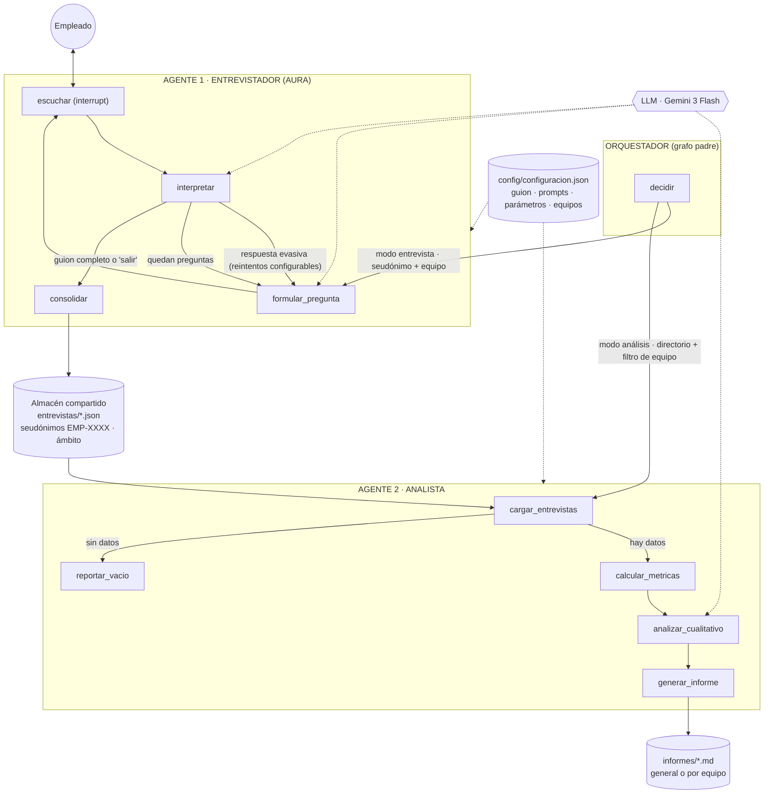

# Arquitectura del sistema

## Visión general

El sistema está compuesto por **dos agentes con roles diferenciados** y un
**orquestador explícito**, todos implementados como grafos de LangGraph, con
**dos ámbitos de medición**: compañía en general o un equipo específico.

| Componente | Rol | Herramientas |
|---|---|---|
| Orquestador (grafo padre) | Validar la solicitud y enrutar al agente correcto, propagando el ámbito (general o equipo) | LangGraph (aristas condicionales), checkpointer compartido |
| Agente 1 · Entrevistador (AURA) | Conducir la entrevista conversacional, cubrir el guion completo, interpretar respuestas y consolidar el registro seudonimizado con su ámbito | LLM (Gemini 3 Flash), `interrupt()` human-in-the-loop, escritura JSON, telemetría, configuración en vivo |
| Agente 2 · Analista | Cargar el corpus (filtrable por equipo), calcular métricas deterministas, análisis cualitativo e informe segmentado con umbral de anonimato | Lectura JSON tolerante a corruptos, estadística en Python, LLM (Gemini 3 Flash), escritura Markdown, telemetría |

## Diagrama de agentes y flujo de mensajes

Versión visual del diagrama: [`diagrama_arquitectura.png`](diagrama_arquitectura.png)

## Mecanismo de orquestación

1. **Enrutamiento explícito (patrón supervisor/router).** El orquestador es un
   `StateGraph` padre: el nodo `decidir` valida la entrada (modo, seudónimo o
   directorio, ámbito) y una arista condicional delega en el subgrafo del
   agente correspondiente. Los subgrafos se compilan con `checkpointer=True`
   para heredar la persistencia del padre.
2. **Human-in-the-loop.** El nodo `escuchar` del Entrevistador ejecuta
   `interrupt(...)`: el grafo completo se pausa, la interfaz (web o CLI)
   muestra la pregunta, captura la respuesta y reanuda con
   `Command(resume=respuesta)`. El estado (pregunta actual, historial,
   respuestas interpretadas) persiste en el checkpointer entre turnos.
3. **Sincronización entre agentes por artefactos (patrón blackboard).** El
   Entrevistador publica registros JSON seudonimizados —con su ámbito— en
   `entrevistas/`; el Analista los consume cuando se le invoca, filtrando por
   equipo si el análisis es segmentado. Este bus de artefactos desacopla a los
   agentes en el tiempo: pueden ejecutarse N entrevistas (incluso en días
   distintos) y un único análisis posterior.

## Ámbitos de medición y anonimato

- Cada entrevista declara su ámbito: **compañía en general** o **un equipo**
  (lista configurable). El registro lo conserva y el Analista puede analizar
  todo el corpus o solo un equipo.
- El informe general incluye una tabla de resultados por equipo; el informe de
  equipo lleva título y archivo propios.
- **Umbral de anonimato:** los equipos con menos entrevistas que el mínimo
  configurado no se reportan individualmente (aparecen como "no reportado") y
  sus informes llevan aviso de confidencialidad, para evitar la
  reidentificación en grupos pequeños.

## Capa de configuración

Los valores de fábrica viven en código versionado
(`src/config/configuracion.py`); los cambios hechos desde la pestaña
**Configuración** de la interfaz se persisten en `config/configuracion.json` y
tienen prioridad. Son editables sin tocar código: el guion de preguntas
(agregar/quitar/editar, dimensión, pregunta de permanencia), el prompt completo
del Entrevistador (personalidad, reglas, instrucciones de inicio/transición/
repregunta, máximo de repreguntas), los parámetros del Analista (umbral de
alerta, límites del análisis cualitativo, umbral de anonimato, instrucciones
adicionales), los equipos de la organización y el modelo/temperatura del LLM.
**Los agentes leen la configuración en cada llamada**, por lo que un cambio
guardado aplica de inmediato a la siguiente entrevista o análisis.

## Estado de cada grafo

- `EstadoOrquestador`: `modo`, `empleado_id`, `equipo`, `directorio`,
  `resultado`.
- `EstadoEntrevista`: `empleado_id`, `equipo`, `indice` (pregunta actual),
  `reintentos`, `historial` (conversación completa), `respuestas`
  (interpretadas), `siguiente_paso` (decisión de enrutamiento),
  `salida_anticipada`.
- `EstadoAnalisis`: `directorio`, `equipo` (filtro opcional), `entrevistas`,
  `metricas`, `analisis_cualitativo`, `ruta_informe`.

## Capa de presentación y observabilidad

- **Dos front-ends, un solo núcleo:** `app.py` (Streamlit: chat de entrevista
  con selector de ámbito, dashboard segmentado y panel de configuración) y
  `main.py` (CLI con `--equipo`) consumen los mismos grafos compilados; el
  patrón `interrupt`/`Command(resume=...)` es idéntico en ambos canales.
- **Telemetría:** `src/utils/telemetria.py` registra en
  `observabilidad/eventos.jsonl` cada llamada al LLM (agente, nodo, latencia,
  éxito) y los hitos `entrevista_iniciada`, `entrevista_finalizada` (con su
  equipo) y `analisis_ejecutado`. El dashboard deriva de ahí las métricas
  operativas **diferenciadas por agente** (llamadas, latencia media y errores
  del Entrevistador y del Analista por separado), la tabla por nodo y la tasa
  de finalización (participación y abandono).

## Manejo de errores

| Fallo | Comportamiento |
|---|---|
| El LLM no devuelve JSON válido al interpretar | Se registra puntaje neutral (3) con nota explicativa y la entrevista continúa |
| Respuesta evasiva o vacía del empleado | Repregunta amable (máximo configurable, por defecto 1 por pregunta) |
| El empleado abandona (`salir`, Ctrl+C) | Se consolida un registro parcial marcado `completada: false` |
| Archivo de entrevista corrupto | El Analista lo omite con aviso y sigue con el resto |
| Directorio sin entrevistas (o equipo sin registros) | Rama explícita `reportar_vacio` con mensaje claro del ámbito |
| Equipo con pocas entrevistas | Umbral de anonimato: no se reporta individualmente; el informe lleva aviso de confidencialidad |
| Fallo del LLM en el análisis cualitativo | El informe se genera igual con las métricas deterministas |
| Sin API key / sin internet | Modo `USAR_LLM_FALSO=1` para operar con LLM simulado (plan B de la demo) |

## Escalabilidad

- Entrevistas **paralelizables por diseño**: cada una es un hilo (`thread_id`)
  independiente con su propio checkpoint; N empleados pueden conversar a la vez.
- El Analista es **O(n)** sobre los registros y separa cómputo determinista
  (barato, local) del cualitativo (una sola llamada LLM con contexto acotado).
- El proveedor de LLM es **intercambiable en un solo punto** (`src/utils/llm.py`),
  que además normaliza los formatos de respuesta entre versiones de modelos.
- Rutas de evolución declaradas: base de datos con cifrado en lugar de JSON,
  campañas de medición periódicas comparables en el tiempo, interfaz en chat
  corporativo (Teams/Slack) sobre el mismo grafo, `SqliteSaver` para reanudar
  entrevistas entre sesiones, y un ciclo evaluador agente→agente en el que el
  Analista retroalimente la calidad del guion del Entrevistador
  (patrón evaluator-optimizer).
